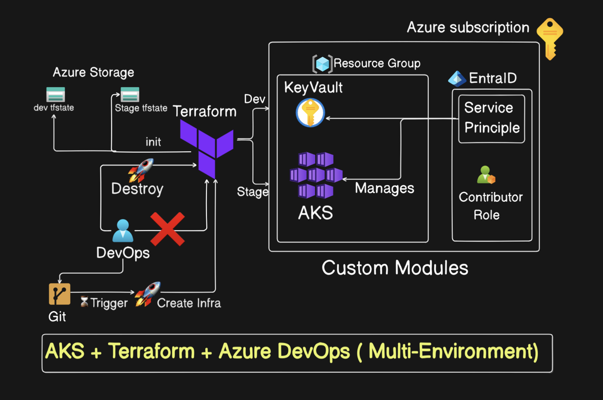

# Azure AKS Multi-Environment Deployment with Terraform

This repository contains Infrastructure as Code (IaC) implementation for deploying Azure Kubernetes Service (AKS) clusters across multiple environments using Terraform and Azure DevOps pipelines.

## Architecture Overview



The architecture implements:
- **Multi-Environment Support**: Separate configurations for dev, staging, and production environments
- **State Management**: Azure Storage for Terraform state files with environment-specific state separation
- **Security**: Azure KeyVault integration for secrets management
- **Identity Management**: Service Principal and EntraID integration
- **Infrastructure Automation**: Azure DevOps pipelines for infrastructure deployment

## Prerequisites

- Azure Subscription
- Azure DevOps Project
- Service Principal with required permissions
- Terraform (v1.5.7 or later)
- Azure CLI

## Repository Structure

```
├── modules/                    # Reusable Terraform modules
│   ├── aks/                   # AKS cluster configuration
│   ├── keyvault/              # Azure KeyVault setup
│   └── ServicePrincipal/      # Service Principal management
├── dev/                       # Development environment
├── staging/                   # Staging environment
├── pipeline/                  # Azure DevOps pipeline definitions
└── scripts/                   # Utility scripts
```

## Key Features

- **Custom Modules**: Modular infrastructure components for reusability
- **Multi-AZ Deployment**: AKS clusters deployed across availability zones
- **Auto-scaling**: Node pool auto-scaling configuration
- **Network Security**: Azure-native network plugin integration
- **State Management**: Remote state storage in Azure Storage

## Deployment Pipeline

The repository includes Azure DevOps pipeline definitions for:
- Infrastructure deployment (`pipeline/create.yaml`)
- Infrastructure teardown (`pipeline/destroy.yaml`)

Pipelines implement:
- Environment-specific deployments
- Terraform initialization and planning
- Automated apply/destroy operations
- Service Principal authentication

## Getting Started

1. **Configure Azure Storage Account**
   - Create storage account for Terraform state
   - Create containers for each environment

2. **Set up Azure KeyVault**
   - Create KeyVault instance
   - Store required secrets
   - Configure access policies

3. **Configure Azure DevOps**
   - Create service connection
   - Configure pipeline variables
   - Import pipeline definitions

4. **Deploy Infrastructure**
   - Trigger pipeline for desired environment
   - Monitor deployment progress
   - Verify resources in Azure Portal

## Security Considerations

- Service Principal with minimum required permissions
- Secrets stored in Azure KeyVault
- Network security with Azure CNI
- RBAC implementation
